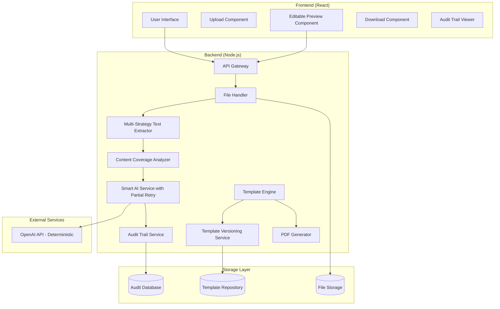
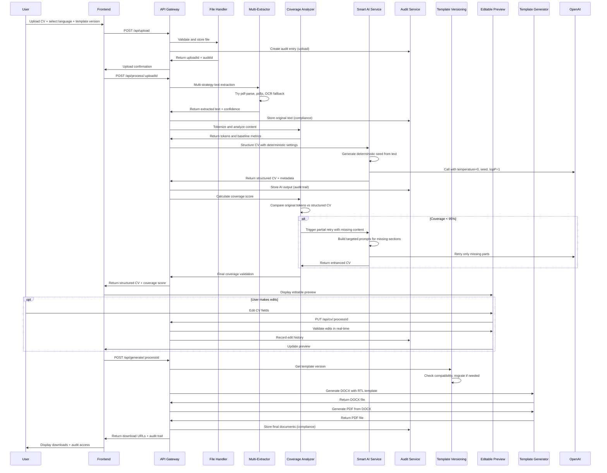
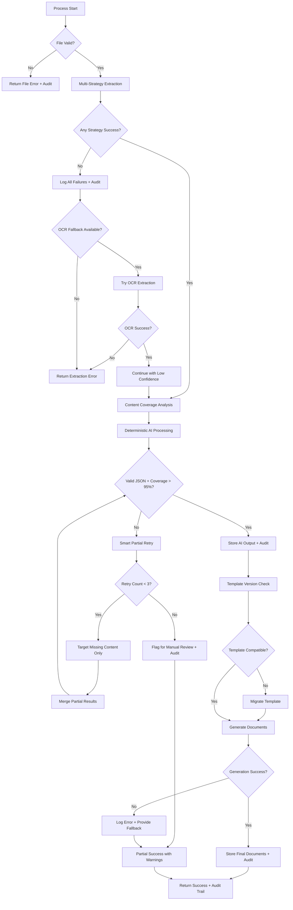
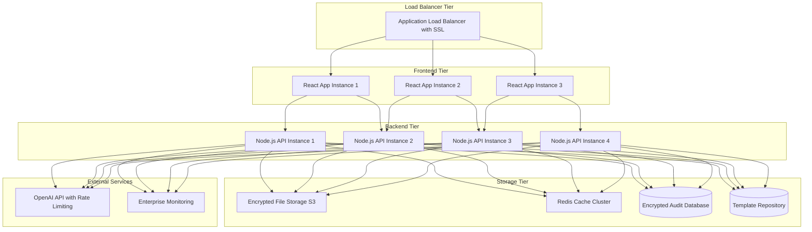

# Design Document: CV Matrix Converter

## Overview

The CV Matrix Converter is an enterprise-grade, full-stack web application that transforms CV files (PDF/DOCX) into a standardized Matrix format with zero tolerance for data loss and maximum reliability. The system employs advanced content coverage mechanisms, multi-strategy PDF extraction, intelligent AI retry logic, template versioning, comprehensive audit trails, and deterministic processing for enterprise recruiters.

### Key Design Principles

- **Zero Data Loss**: Multi-layer validation with tokenization-based coverage scoring ensures 95%+ content preservation
- **Enterprise Reliability**: Comprehensive audit trails, deterministic AI settings, and robust fallback mechanisms
- **Advanced PDF Processing**: Multiple parsing strategies with intelligent fallback for maximum extraction success
- **Smart AI Retry Logic**: Partial retry mechanisms that avoid duplication and target missing content specifically
- **Template Versioning**: Full version control with backward compatibility and migration strategies
- **Language Agnostic**: Pre-defined RTL templates for Hebrew and English with optimized performance
- **Editable Preview**: Real-time preview with user editing capabilities and validation
- **Scalable Architecture**: Cloud-ready design supporting concurrent enterprise users
- **Comprehensive Audit**: Complete processing history for compliance and debugging

## Architecture

### System Architecture Overview



### Component Separation

**Frontend Responsibilities:**
- File upload interface with drag-and-drop
- Language selection (Hebrew/English)
- Real-time processing status with detailed progress
- Editable CV preview with real-time validation
- Download management with audit trail access
- Template version selection interface

**Backend Responsibilities:**
- Multi-strategy file validation and temporary storage
- Advanced text extraction with fallback mechanisms
- Content coverage analysis with tokenization
- Smart AI integration with partial retry logic
- Comprehensive audit trail management
- Template versioning and migration handling
- Document generation with deterministic settings
- Enterprise-grade logging and error handling

## Components and Interfaces

### Frontend Components

#### Upload Component
```typescript
interface UploadComponentProps {
  onFileSelect: (file: File, language: 'he' | 'en') => void;
  supportedFormats: string[];
  maxFileSize: number;
  templateVersions: TemplateVersion[];
  onTemplateVersionSelect: (version: string) => void;
}
```

#### Editable Preview Component
```typescript
interface EditablePreviewComponentProps {
  structuredCV: MatrixCV;
  language: 'he' | 'en';
  onEdit: (field: string, value: any) => void;
  onValidate: (cv: MatrixCV) => ValidationResult;
  isEditing: boolean;
  validationErrors: ValidationError[];
}

interface ValidationError {
  field: string;
  message: string;
  severity: 'error' | 'warning';
}
```

#### Audit Trail Viewer Component
```typescript
interface AuditTrailViewerProps {
  processId: string;
  auditEntries: AuditEntry[];
  onViewOriginal: () => void;
  onViewAIOutput: () => void;
  onViewFinalDocument: () => void;
}
```

#### Download Component
```typescript
interface DownloadComponentProps {
  docxUrl: string;
  pdfUrl: string;
  filename: string;
  auditTrailUrl: string;
  onDownload: (format: 'docx' | 'pdf' | 'audit') => void;
}
```

### Backend API Endpoints

#### File Upload Endpoint
```
POST /api/upload
Content-Type: multipart/form-data
Body: { 
  file: File, 
  language: 'he' | 'en',
  templateVersion?: string 
}
Response: { 
  uploadId: string, 
  status: 'uploaded',
  auditId: string 
}
```

#### Process CV Endpoint
```
POST /api/process/:uploadId
Body: { 
  deterministicSettings: {
    temperature: 0,
    seed: number,
    topP: 1
  }
}
Response: { 
  processId: string, 
  status: 'processing' | 'completed' | 'failed',
  structuredCV?: MatrixCV,
  coverageScore?: number,
  missingContent?: string[],
  auditTrail: AuditEntry[],
  errors?: string[]
}
```

#### Edit CV Endpoint
```
PUT /api/cv/:processId
Body: { 
  updatedCV: MatrixCV,
  editHistory: EditAction[]
}
Response: { 
  validationResult: ValidationResult,
  updatedAuditTrail: AuditEntry[]
}
```

#### Generate Documents Endpoint
```
POST /api/generate/:processId
Body: { 
  formats: ['docx', 'pdf'],
  templateVersion?: string,
  finalCV: MatrixCV
}
Response: { 
  docxUrl?: string, 
  pdfUrl?: string,
  auditTrailUrl: string,
  expiresAt: string 
}
```

#### Audit Trail Endpoint
```
GET /api/audit/:processId
Response: {
  auditEntries: AuditEntry[],
  originalTextUrl: string,
  aiOutputUrl: string,
  finalDocumentUrl: string,
  processingHistory: ProcessingStep[]
}
```

#### Template Versions Endpoint
```
GET /api/templates
Query: { language: 'he' | 'en' }
Response: {
  versions: TemplateVersion[],
  current: string,
  deprecated: string[]
}
```

### Core Service Interfaces

#### Multi-Strategy Text Extractor Service
```typescript
interface MultiStrategyTextExtractorService {
  extractFromPDF(buffer: Buffer): Promise<ExtractedText>;
  extractFromDOCX(buffer: Buffer): Promise<ExtractedText>;
  
  // Multiple PDF parsing strategies
  private extractPDFWithPdfParse(buffer: Buffer): Promise<ExtractedText>;
  private extractPDFWithPdfJs(buffer: Buffer): Promise<ExtractedText>;
  private extractPDFWithFallback(buffer: Buffer): Promise<ExtractedText>;
}

interface ExtractedText {
  content: string;
  metadata: {
    pageCount?: number;
    wordCount: number;
    hasImages: boolean;
    language: 'he' | 'en' | 'mixed';
    extractionMethod: 'pdf-parse' | 'pdfjs' | 'fallback' | 'docx';
    confidence: number;
  };
  tokens: string[];
}
```

#### Content Coverage Analyzer Service
```typescript
interface ContentCoverageAnalyzer {
  tokenizeText(text: string): string[];
  calculateCoverage(originalTokens: string[], structuredCV: MatrixCV): CoverageResult;
  identifyMissingContent(originalTokens: string[], structuredCV: MatrixCV): MissingContent[];
}

interface CoverageResult {
  score: number; // 0-100
  coveredTokens: string[];
  missingTokens: string[];
  confidence: number;
  requiresRetry: boolean; // true if score < 95%
}

interface MissingContent {
  tokens: string[];
  context: string;
  suggestedSection: keyof MatrixCV;
  priority: 'high' | 'medium' | 'low';
}
```

#### Smart AI Service Interface
```typescript
interface SmartAIService {
  structureCV(text: string, language: 'he' | 'en', settings: DeterministicSettings): Promise<AIResult>;
  partialRetry(originalText: string, existingCV: MatrixCV, missingContent: MissingContent[], language: 'he' | 'en'): Promise<MatrixCV>;
  validateJSON(response: string): MatrixCV | null;
}

interface DeterministicSettings {
  temperature: 0;
  seed: number;
  topP: 1;
  maxTokens: number;
  model: string;
}

interface AIResult {
  structuredCV: MatrixCV;
  confidence: number;
  processingTime: number;
  tokensUsed: number;
  retryCount: number;
}
```

#### Audit Trail Service Interface
```typescript
interface AuditTrailService {
  createAuditEntry(processId: string, entry: AuditEntry): Promise<void>;
  storeOriginalText(processId: string, text: string): Promise<string>;
  storeAIOutput(processId: string, output: MatrixCV, metadata: AIMetadata): Promise<string>;
  storeFinalDocument(processId: string, document: Buffer, format: 'docx' | 'pdf'): Promise<string>;
  getProcessingHistory(processId: string): Promise<ProcessingHistory>;
}

interface AuditEntry {
  timestamp: Date;
  step: ProcessingStep;
  input?: any;
  output?: any;
  metadata: {
    duration: number;
    success: boolean;
    errorMessage?: string;
    retryCount?: number;
  };
}

interface ProcessingHistory {
  processId: string;
  startTime: Date;
  endTime?: Date;
  totalDuration?: number;
  steps: AuditEntry[];
  originalTextUrl: string;
  aiOutputUrl?: string;
  finalDocumentUrls: { format: string; url: string }[];
}
```

#### Template Versioning Service Interface
```typescript
interface TemplateVersioningService {
  getCurrentVersion(language: 'he' | 'en'): Promise<TemplateVersion>;
  getVersion(language: 'he' | 'en', version: string): Promise<TemplateVersion>;
  migrateTemplate(fromVersion: string, toVersion: string, data: MatrixCV): Promise<MatrixCV>;
  isCompatible(templateVersion: string, dataVersion: string): boolean;
  listVersions(language: 'he' | 'en'): Promise<TemplateVersion[]>;
}

interface TemplateVersion {
  version: string;
  language: 'he' | 'en';
  templatePath: string;
  schema: JSONSchema;
  deprecated: boolean;
  migrationPath?: string[];
  createdAt: Date;
  compatibleWith: string[];
}
```

## Data Models

### Enhanced Matrix CV Schema
```typescript
interface MatrixCV {
  personal_details: {
    name: string;
    email?: string;
    phone?: string;
    address?: string;
    linkedin?: string;
  };
  summary: string;
  experience: Experience[];
  skills: string[];
  education: Education[];
  languages: Language[];
  additional: string;
  
  // Enterprise metadata
  metadata: {
    version: string;
    templateVersion: string;
    language: 'he' | 'en';
    coverageScore: number;
    lastModified: Date;
    editHistory: EditAction[];
  };
}

interface Experience {
  years: string;
  role: string;
  company?: string;
  description: string;
}

interface Education {
  degree: string;
  institution: string;
  year?: string;
  details?: string;
}

interface Language {
  name: string;
  level: string;
}

interface EditAction {
  timestamp: Date;
  field: string;
  oldValue: any;
  newValue: any;
  userId?: string;
}
```

### Enhanced Processing State Model
```typescript
interface ProcessingState {
  uploadId: string;
  processId: string;
  auditId: string;
  status: 'uploaded' | 'extracting' | 'analyzing' | 'processing' | 'retrying' | 'validating' | 'editing' | 'generating' | 'completed' | 'failed';
  language: 'he' | 'en';
  templateVersion: string;
  
  originalFile: {
    name: string;
    size: number;
    type: string;
    hash: string;
  };
  
  extractedText?: {
    content: string;
    tokens: string[];
    method: string;
    confidence: number;
  };
  
  coverageAnalysis?: {
    score: number;
    missingTokens: string[];
    missingContent: MissingContent[];
  };
  
  structuredCV?: MatrixCV;
  aiMetadata?: {
    model: string;
    settings: DeterministicSettings;
    tokensUsed: number;
    processingTime: number;
    retryCount: number;
  };
  
  generatedFiles?: {
    docxUrl?: string;
    pdfUrl?: string;
    auditTrailUrl?: string;
  };
  
  auditTrail: AuditEntry[];
  errors: ProcessingError[];
  createdAt: Date;
  updatedAt: Date;
}

interface ProcessingError {
  step: string;
  message: string;
  timestamp: Date;
  retryCount: number;
  severity: 'error' | 'warning' | 'info';
  recoverable: boolean;
}
```

## Enterprise-Grade Improvements

### Content Coverage Mechanism

The system implements a sophisticated tokenization-based coverage analysis to ensure 95%+ content preservation:

```typescript
class ContentCoverageAnalyzer {
  tokenizeText(text: string): string[] {
    // Advanced tokenization preserving technical terms, dates, and names
    return text
      .toLowerCase()
      .replace(/[^\w\s\u0590-\u05FF]/g, ' ') // Preserve Hebrew characters
      .split(/\s+/)
      .filter(token => token.length > 2)
      .filter(token => !this.isStopWord(token));
  }
  
  calculateCoverage(originalTokens: string[], structuredCV: MatrixCV): CoverageResult {
    const cvText = this.flattenCVToText(structuredCV);
    const cvTokens = this.tokenizeText(cvText);
    
    const coveredTokens = originalTokens.filter(token => 
      cvTokens.some(cvToken => this.isSimilar(token, cvToken))
    );
    
    const score = (coveredTokens.length / originalTokens.length) * 100;
    
    return {
      score,
      coveredTokens,
      missingTokens: originalTokens.filter(token => !coveredTokens.includes(token)),
      confidence: this.calculateConfidence(score, originalTokens.length),
      requiresRetry: score < 95
    };
  }
}
```

### Multi-Strategy PDF Extraction

Robust PDF extraction with multiple parsing strategies and intelligent fallbacks:

```typescript
class MultiStrategyPDFExtractor {
  async extractFromPDF(buffer: Buffer): Promise<ExtractedText> {
    const strategies = [
      () => this.extractWithPdfParse(buffer),
      () => this.extractWithPdfJs(buffer),
      () => this.extractWithTesseractOCR(buffer) // OCR fallback
    ];
    
    for (const [index, strategy] of strategies.entries()) {
      try {
        const result = await strategy();
        if (result.confidence > 0.8) {
          return { ...result, extractionMethod: this.getMethodName(index) };
        }
      } catch (error) {
        console.warn(`PDF extraction strategy ${index} failed:`, error.message);
      }
    }
    
    throw new Error('All PDF extraction strategies failed');
  }
  
  private async extractWithPdfParse(buffer: Buffer): Promise<ExtractedText> {
    const pdfParse = require('pdf-parse');
    const data = await pdfParse(buffer);
    
    return {
      content: data.text,
      tokens: this.tokenize(data.text),
      metadata: {
        pageCount: data.numpages,
        wordCount: data.text.split(/\s+/).length,
        hasImages: data.text.includes('[image]'),
        language: this.detectLanguage(data.text),
        confidence: 0.9
      }
    };
  }
  
  private async extractWithPdfJs(buffer: Buffer): Promise<ExtractedText> {
    const pdfjsLib = require('pdfjs-dist/legacy/build/pdf');
    const doc = await pdfjsLib.getDocument({ data: buffer }).promise;
    
    let fullText = '';
    for (let i = 1; i <= doc.numPages; i++) {
      const page = await doc.getPage(i);
      const textContent = await page.getTextContent();
      const pageText = textContent.items.map(item => item.str).join(' ');
      fullText += pageText + '\n';
    }
    
    return {
      content: fullText,
      tokens: this.tokenize(fullText),
      metadata: {
        pageCount: doc.numPages,
        wordCount: fullText.split(/\s+/).length,
        hasImages: false,
        language: this.detectLanguage(fullText),
        confidence: 0.85
      }
    };
  }
}
```

### Smart AI Retry Logic

Intelligent partial retry mechanism that avoids duplication and targets missing content:

```typescript
class SmartAIService {
  async partialRetry(
    originalText: string, 
    existingCV: MatrixCV, 
    missingContent: MissingContent[], 
    language: 'he' | 'en'
  ): Promise<MatrixCV> {
    // Group missing content by suggested sections
    const contentBySections = this.groupMissingContentBySections(missingContent);
    
    const updatedCV = { ...existingCV };
    
    for (const [section, content] of Object.entries(contentBySections)) {
      const prompt = this.buildPartialRetryPrompt(
        content,
        section as keyof MatrixCV,
        existingCV,
        language
      );
      
      try {
        const partialResult = await this.callOpenAI(prompt, {
          temperature: 0,
          seed: this.generateDeterministicSeed(originalText),
          topP: 1,
          maxTokens: 1000
        });
        
        // Merge partial result into existing CV without duplication
        this.mergePartialResult(updatedCV, partialResult, section as keyof MatrixCV);
        
      } catch (error) {
        console.warn(`Partial retry failed for section ${section}:`, error.message);
      }
    }
    
    return updatedCV;
  }
  
  private buildPartialRetryPrompt(
    missingContent: MissingContent[],
    section: keyof MatrixCV,
    existingCV: MatrixCV,
    language: 'he' | 'en'
  ): string {
    const contextTokens = missingContent.flatMap(mc => mc.tokens).join(' ');
    const existingSection = JSON.stringify(existingCV[section]);
    
    return `
      You are processing a CV and need to extract missing information for the ${section} section.
      
      Current ${section} content: ${existingSection}
      
      Missing content context: ${contextTokens}
      
      Please extract ONLY the missing information that should be added to the ${section} section.
      Respond in ${language === 'he' ? 'Hebrew' : 'English'}.
      Return only valid JSON that can be merged with the existing section.
      Do NOT duplicate existing information.
    `;
  }
  
  private mergePartialResult(cv: MatrixCV, partialResult: any, section: keyof MatrixCV): void {
    if (Array.isArray(cv[section])) {
      // For arrays (experience, skills, education, languages), append unique items
      const existing = cv[section] as any[];
      const newItems = Array.isArray(partialResult) ? partialResult : [partialResult];
      
      newItems.forEach(item => {
        if (!this.isDuplicate(item, existing)) {
          existing.push(item);
        }
      });
    } else if (typeof cv[section] === 'string') {
      // For strings, append if not already present
      const existingText = cv[section] as string;
      const newText = typeof partialResult === 'string' ? partialResult : JSON.stringify(partialResult);
      
      if (!existingText.includes(newText)) {
        cv[section] = existingText + (existingText ? '\n' : '') + newText;
      }
    } else if (typeof cv[section] === 'object') {
      // For objects, merge properties
      Object.assign(cv[section], partialResult);
    }
  }
}
```

### Template Versioning System

Comprehensive template versioning with backward compatibility and migration:

```typescript
class TemplateVersioningService {
  async migrateTemplate(fromVersion: string, toVersion: string, data: MatrixCV): Promise<MatrixCV> {
    const migrationPath = await this.findMigrationPath(fromVersion, toVersion);
    
    let migratedData = { ...data };
    
    for (const step of migrationPath) {
      migratedData = await this.applyMigrationStep(migratedData, step);
    }
    
    return migratedData;
  }
  
  private async applyMigrationStep(data: MatrixCV, step: MigrationStep): Promise<MatrixCV> {
    switch (step.type) {
      case 'field_rename':
        return this.renameField(data, step.from, step.to);
      case 'field_split':
        return this.splitField(data, step.field, step.newFields);
      case 'field_merge':
        return this.mergeFields(data, step.fields, step.newField);
      case 'schema_transform':
        return this.transformSchema(data, step.transformer);
      default:
        return data;
    }
  }
  
  async getCurrentTemplate(language: 'he' | 'en'): Promise<TemplateVersion> {
    // Use pre-defined RTL templates for better performance
    const templatePath = language === 'he' 
      ? './templates/hebrew-rtl-template-v2.docx'
      : './templates/english-template-v2.docx';
      
    return {
      version: '2.0.0',
      language,
      templatePath,
      schema: await this.loadSchema(templatePath),
      deprecated: false,
      createdAt: new Date(),
      compatibleWith: ['1.9.0', '1.8.0']
    };
  }
}
```

### Comprehensive Audit Trail

Complete processing history for compliance and debugging:

```typescript
class AuditTrailService {
  async storeOriginalText(processId: string, text: string): Promise<string> {
    const hash = this.generateHash(text);
    const storageKey = `original/${processId}/${hash}.txt`;
    
    await this.storage.store(storageKey, text, {
      encryption: true,
      retention: '7years', // Compliance requirement
      metadata: {
        processId,
        timestamp: new Date(),
        type: 'original_text',
        size: text.length
      }
    });
    
    return storageKey;
  }
  
  async storeAIOutput(processId: string, output: MatrixCV, metadata: AIMetadata): Promise<string> {
    const auditRecord = {
      processId,
      timestamp: new Date(),
      aiOutput: output,
      aiMetadata: metadata,
      hash: this.generateHash(JSON.stringify(output))
    };
    
    const storageKey = `ai_output/${processId}/${auditRecord.hash}.json`;
    
    await this.storage.store(storageKey, JSON.stringify(auditRecord), {
      encryption: true,
      retention: '7years',
      metadata: {
        processId,
        type: 'ai_output',
        model: metadata.model,
        tokensUsed: metadata.tokensUsed
      }
    });
    
    return storageKey;
  }
  
  async createComplianceReport(processId: string): Promise<ComplianceReport> {
    const history = await this.getProcessingHistory(processId);
    
    return {
      processId,
      generatedAt: new Date(),
      dataRetention: '7years',
      processingSteps: history.steps.length,
      originalTextStored: !!history.originalTextUrl,
      aiOutputStored: !!history.aiOutputUrl,
      finalDocumentStored: history.finalDocumentUrls.length > 0,
      complianceStatus: 'compliant',
      auditTrail: history.steps
    };
  }
}
```

### Deterministic AI Settings

Consistent outputs through deterministic configuration:

```typescript
class DeterministicAIService {
  private readonly DETERMINISTIC_SETTINGS: DeterministicSettings = {
    temperature: 0,        // No randomness
    topP: 1,              // Consider all tokens
    seed: null,           // Will be set per request
    maxTokens: 4000,
    model: 'gpt-4-turbo'
  };
  
  async structureCV(text: string, language: 'he' | 'en'): Promise<AIResult> {
    const seed = this.generateDeterministicSeed(text);
    const settings = { ...this.DETERMINISTIC_SETTINGS, seed };
    
    const startTime = Date.now();
    
    const response = await this.openai.chat.completions.create({
      model: settings.model,
      messages: [
        {
          role: 'system',
          content: this.buildSystemPrompt(language)
        },
        {
          role: 'user',
          content: text
        }
      ],
      temperature: settings.temperature,
      top_p: settings.topP,
      seed: settings.seed,
      max_tokens: settings.maxTokens
    });
    
    const processingTime = Date.now() - startTime;
    
    return {
      structuredCV: JSON.parse(response.choices[0].message.content),
      confidence: this.calculateConfidence(response),
      processingTime,
      tokensUsed: response.usage.total_tokens,
      retryCount: 0
    };
  }
  
  private generateDeterministicSeed(text: string): number {
    // Generate consistent seed based on text content
    let hash = 0;
    for (let i = 0; i < text.length; i++) {
      const char = text.charCodeAt(i);
      hash = ((hash << 5) - hash) + char;
      hash = hash & hash; // Convert to 32-bit integer
    }
    return Math.abs(hash);
  }
}
```

### Editable Preview System

Real-time preview with validation and edit capabilities:

```typescript
class EditablePreviewService {
  validateEdit(field: string, value: any, cv: MatrixCV): ValidationResult {
    const validators = {
      'personal_details.email': this.validateEmail,
      'personal_details.phone': this.validatePhone,
      'experience': this.validateExperience,
      'skills': this.validateSkills,
      'education': this.validateEducation
    };
    
    const validator = validators[field] || this.validateGeneric;
    return validator(value, cv);
  }
  
  async applyEdit(processId: string, field: string, value: any): Promise<EditResult> {
    const currentCV = await this.getCurrentCV(processId);
    const validationResult = this.validateEdit(field, value, currentCV);
    
    if (!validationResult.isValid) {
      return {
        success: false,
        errors: validationResult.errors,
        cv: currentCV
      };
    }
    
    const updatedCV = this.applyFieldUpdate(currentCV, field, value);
    
    // Record edit in audit trail
    await this.auditService.recordEdit(processId, {
      timestamp: new Date(),
      field,
      oldValue: this.getFieldValue(currentCV, field),
      newValue: value,
      userId: this.getCurrentUserId()
    });
    
    // Update coverage score after edit
    const originalText = await this.getOriginalText(processId);
    const coverageResult = await this.coverageAnalyzer.calculateCoverage(
      this.tokenizeText(originalText),
      updatedCV
    );
    
    updatedCV.metadata.coverageScore = coverageResult.score;
    updatedCV.metadata.lastModified = new Date();
    
    return {
      success: true,
      cv: updatedCV,
      coverageScore: coverageResult.score,
      validationResult
    };
  }
}
```

## Data Flow Diagram

### Enhanced Step-by-Step Processing Flow



### Enhanced Error Handling Flow



## Error Handling Strategy

### Error Categories and Responses

#### File Processing Errors
- **Invalid Format**: Return 400 with supported formats list
- **File Too Large**: Return 413 with size limits
- **Corrupted File**: Return 422 with repair suggestions
- **Password Protected**: Return 423 with credential request

#### Text Extraction Errors
- **PDF Parsing Failure**: Retry with alternative parser, log details
- **DOCX Structure Issues**: Attempt recovery, preserve partial content
- **Encoding Problems**: Auto-detect and convert encoding

#### AI Processing Errors
- **API Rate Limits**: Implement exponential backoff (1s, 2s, 4s, 8s)
- **Invalid JSON Response**: Retry with stricter prompts up to 3 times
- **Content Hallucination**: Cross-validate with original text
- **Language Mixing**: Re-prompt with language specification

#### Validation Errors
- **Missing Content**: Trigger AI retry with specific missing items
- **Format Inconsistencies**: Apply automatic corrections where possible
- **Schema Violations**: Return detailed validation errors

#### Document Generation Errors
- **Template Processing**: Fallback to basic template, log complex failures
- **PDF Conversion**: Retry with different engines, provide DOCX as fallback
- **File System Issues**: Implement temporary storage cleanup and retry

### Logging Strategy

#### Log Levels and Content
```typescript
interface LogEntry {
  level: 'error' | 'warn' | 'info' | 'debug';
  timestamp: Date;
  processId: string;
  component: string;
  message: string;
  metadata?: {
    userId?: string;
    fileSize?: number;
    language?: string;
    retryCount?: number;
    errorCode?: string;
    stackTrace?: string;
  };
}
```

#### Critical Logging Points
- File upload and validation results
- Text extraction success/failure with character counts
- AI API requests and responses (sanitized)
- Content validation results and missing items
- Document generation timing and file sizes
- Error occurrences with full context
- Performance metrics for optimization

### Retry Logic Implementation

#### AI Service Retry Strategy
```typescript
class AIServiceWithRetry {
  async structureCV(text: string, language: string, retryCount = 0): Promise<MatrixCV> {
    try {
      const response = await this.callOpenAI(text, language);
      const structured = this.validateJSON(response);
      if (!structured) throw new Error('Invalid JSON response');
      return structured;
    } catch (error) {
      if (retryCount < 3) {
        const delay = Math.pow(2, retryCount) * 1000; // Exponential backoff
        await this.sleep(delay);
        return this.structureCV(text, language, retryCount + 1);
      }
      throw error;
    }
  }
}
```

## Enhanced Hebrew and RTL Support Implementation

### Pre-Defined RTL Template System

The system uses pre-defined RTL templates for optimal performance and consistency, eliminating runtime formatting overhead:

```typescript
class EnhancedRTLTemplateService {
  private readonly TEMPLATE_REGISTRY = {
    'he': {
      'v2.0.0': './templates/hebrew-rtl-v2.docx',
      'v1.9.0': './templates/hebrew-rtl-v1.9.docx'
    },
    'en': {
      'v2.0.0': './templates/english-ltr-v2.docx',
      'v1.9.0': './templates/english-ltr-v1.9.docx'
    }
  };
  
  async getOptimizedTemplate(language: 'he' | 'en', version?: string): Promise<TemplateInfo> {
    const targetVersion = version || this.getCurrentVersion(language);
    const templatePath = this.TEMPLATE_REGISTRY[language][targetVersion];
    
    if (!templatePath) {
      throw new TemplateNotFoundError(`Template not found for ${language} v${targetVersion}`);
    }
    
    return {
      path: templatePath,
      language,
      version: targetVersion,
      rtlOptimized: language === 'he',
      preProcessed: true // No runtime RTL formatting needed
    };
  }
  
  async loadPreProcessedTemplate(templateInfo: TemplateInfo): Promise<Buffer> {
    // Templates are pre-processed with RTL formatting
    // No runtime formatting modifications needed
    return await fs.readFile(templateInfo.path);
  }
}
```

### Separate Hebrew and English Template Files

#### Hebrew RTL Template Features
- **Pre-configured RTL Direction**: All paragraph and text runs have RTL direction set
- **Hebrew Font Optimization**: Noto Sans Hebrew with proper fallbacks
- **Bidirectional Text Handling**: Mixed Hebrew/English content properly aligned
- **Cultural Layout Preferences**: Right-aligned headers, RTL bullet points

#### English LTR Template Features  
- **Standard LTR Layout**: Left-to-right text flow and alignment
- **Western Font Stack**: Professional fonts optimized for Latin characters
- **Standard Business Format**: Conventional CV layout patterns

```typescript
interface RTLTemplateStructure {
  // Hebrew template has pre-set RTL properties
  hebrewTemplate: {
    documentDefaults: {
      direction: 'rtl';
      textAlign: 'right';
      fontFamily: 'Noto Sans Hebrew, Arial Hebrew';
    };
    paragraphStyles: {
      heading: { rtl: true, alignment: 'right' };
      body: { rtl: true, alignment: 'right' };
      list: { rtl: true, bulletAlignment: 'right' };
    };
  };
  
  // English template uses standard LTR
  englishTemplate: {
    documentDefaults: {
      direction: 'ltr';
      textAlign: 'left';
      fontFamily: 'Calibri, Arial, sans-serif';
    };
    paragraphStyles: {
      heading: { rtl: false, alignment: 'left' };
      body: { rtl: false, alignment: 'left' };
      list: { rtl: false, bulletAlignment: 'left' };
    };
  };
}
```

### Enhanced Frontend RTL Handling

```css
/* Optimized RTL styles for Hebrew content */
.hebrew-cv-container {
  direction: rtl;
  text-align: right;
  font-family: 'Noto Sans Hebrew', 'Arial Hebrew', 'David', sans-serif;
  unicode-bidi: embed;
}

.hebrew-cv-container .field-label {
  text-align: right;
  margin-left: 0;
  margin-right: 8px;
}

.hebrew-cv-container .experience-item {
  border-right: 3px solid #007acc;
  border-left: none;
  padding-right: 16px;
  padding-left: 0;
}

/* English LTR styles */
.english-cv-container {
  direction: ltr;
  text-align: left;
  font-family: 'Segoe UI', 'Roboto', 'Arial', sans-serif;
}

.english-cv-container .field-label {
  text-align: left;
  margin-right: 0;
  margin-left: 8px;
}

.english-cv-container .experience-item {
  border-left: 3px solid #007acc;
  border-right: none;
  padding-left: 16px;
  padding-right: 0;
}

/* Mixed content handling */
.mixed-content {
  unicode-bidi: plaintext;
}

.technical-term {
  unicode-bidi: embed;
  direction: ltr; /* Keep technical terms LTR even in RTL context */
}
```

### Backend Language Processing Enhancement

```typescript
class EnhancedLanguageProcessor {
  detectLanguage(text: string): LanguageDetectionResult {
    const hebrewRegex = /[\u0590-\u05FF]/g;
    const englishRegex = /[a-zA-Z]/g;
    const numbersRegex = /\d/g;
    
    const hebrewMatches = text.match(hebrewRegex)?.length || 0;
    const englishMatches = text.match(englishRegex)?.length || 0;
    const numberMatches = text.match(numbersRegex)?.length || 0;
    
    const totalChars = hebrewMatches + englishMatches + numberMatches;
    const hebrewRatio = hebrewMatches / totalChars;
    const englishRatio = englishMatches / totalChars;
    
    return {
      primaryLanguage: hebrewRatio > 0.3 ? 'he' : 'en',
      confidence: Math.max(hebrewRatio, englishRatio),
      hasHebrewContent: hebrewMatches > 0,
      hasEnglishContent: englishMatches > 0,
      isMixed: hebrewMatches > 0 && englishMatches > 0,
      recommendedTemplate: hebrewRatio > 0.3 ? 'hebrew-rtl' : 'english-ltr'
    };
  }
  
  formatForAI(text: string, targetLanguage: 'he' | 'en'): string {
    const languageInstructions = {
      'he': 'אנא עבד את קורות החיים הזה והשב בעברית. שמור על השפה המקורית של מונחים טכניים ושמות עצם.',
      'en': 'Please process this CV and respond in English. Maintain the original language of technical terms and proper nouns.'
    };
    
    return `${languageInstructions[targetLanguage]}
            
            Original CV content: ${text}`;
  }
  
  preserveTechnicalTerms(text: string): ProcessedText {
    // Identify and preserve technical terms, URLs, emails
    const technicalPatterns = [
      /\b[A-Z]{2,}\b/g, // Acronyms
      /\b\w+\.\w+\b/g, // Domain names
      /\b[\w.-]+@[\w.-]+\.\w+\b/g, // Emails
      /https?:\/\/[^\s]+/g, // URLs
      /\b\d{4}-\d{4}\b/g // Years ranges
    ];
    
    let processedText = text;
    const preservedTerms: PreservedTerm[] = [];
    
    technicalPatterns.forEach((pattern, index) => {
      processedText = processedText.replace(pattern, (match) => {
        const placeholder = `__TECH_TERM_${preservedTerms.length}__`;
        preservedTerms.push({
          placeholder,
          original: match,
          type: this.getTermType(pattern)
        });
        return placeholder;
      });
    });
    
    return { processedText, preservedTerms };
  }
}
```

## Enhanced Template Engine Architecture

### Versioned DOCX Template System

```typescript
class VersionedTemplateEngine {
  async generateDOCX(
    structuredCV: MatrixCV, 
    language: 'he' | 'en',
    templateVersion?: string
  ): Promise<GenerationResult> {
    
    // Get appropriate template with version handling
    const templateInfo = await this.templateVersioning.getTemplate(language, templateVersion);
    
    // Handle version migration if needed
    let processedCV = structuredCV;
    if (templateInfo.requiresMigration) {
      processedCV = await this.templateVersioning.migrateData(
        structuredCV,
        templateInfo.fromVersion,
        templateInfo.toVersion
      );
    }
    
    // Load pre-processed template (RTL already configured for Hebrew)
    const templateBuffer = await this.loadTemplate(templateInfo.path);
    
    const zip = new PizZip(templateBuffer);
    const doc = new Docxtemplater(zip, {
      paragraphLoop: true,
      linebreaks: true,
      nullGetter: this.handleMissingData,
      parser: this.customExpressionParser
    });
    
    // Apply data without runtime RTL formatting
    doc.setData(this.prepareTemplateData(processedCV, language));
    doc.render();
    
    const result = doc.getZip().generate({ type: 'nodebuffer' });
    
    return {
      document: result,
      templateVersion: templateInfo.version,
      language,
      migrationApplied: templateInfo.requiresMigration,
      generatedAt: new Date()
    };
  }
  
  private prepareTemplateData(cv: MatrixCV, language: 'he' | 'en'): TemplateData {
    return {
      ...cv,
      // Add language-specific formatting helpers
      formatters: {
        date: (date: string) => this.formatDate(date, language),
        phone: (phone: string) => this.formatPhone(phone, language),
        list: (items: string[]) => this.formatList(items, language)
      },
      // Add RTL/LTR specific content
      direction: language === 'he' ? 'rtl' : 'ltr',
      alignment: language === 'he' ? 'right' : 'left'
    };
  }
}
```

### Template Structure with Version Support

#### Hebrew RTL Template (v2.0.0)
```xml
<?xml version="1.0" encoding="UTF-8"?>
<w:document xmlns:w="http://schemas.openxmlformats.org/wordprocessingml/2006/main">
  <!-- Document defaults with RTL support -->
  <w:body>
    <!-- Header with RTL alignment -->
    <w:p>
      <w:pPr>
        <w:bidi w:val="1"/>
        <w:jc w:val="right"/>
      </w:pPr>
      <w:r>
        <w:rPr>
          <w:rtl w:val="1"/>
          <w:rFonts w:ascii="Noto Sans Hebrew" w:hAnsi="Noto Sans Hebrew"/>
        </w:rPr>
        <w:t>{{personal_details.name}}</w:t>
      </w:r>
    </w:p>
    
    <!-- Experience section with RTL formatting -->
    {{#experience}}
    <w:p>
      <w:pPr>
        <w:bidi w:val="1"/>
        <w:jc w:val="right"/>
      </w:pPr>
      <w:r>
        <w:rPr><w:rtl w:val="1"/></w:rPr>
        <w:t>{{years}} - {{role}}</w:t>
      </w:r>
    </w:p>
    {{/experience}}
  </w:body>
</w:document>
```

#### English LTR Template (v2.0.0)
```xml
<?xml version="1.0" encoding="UTF-8"?>
<w:document xmlns:w="http://schemas.openxmlformats.org/wordprocessingml/2006/main">
  <!-- Document defaults with LTR support -->
  <w:body>
    <!-- Header with LTR alignment -->
    <w:p>
      <w:pPr>
        <w:jc w:val="left"/>
      </w:pPr>
      <w:r>
        <w:rPr>
          <w:rFonts w:ascii="Calibri" w:hAnsi="Calibri"/>
        </w:rPr>
        <w:t>{{personal_details.name}}</w:t>
      </w:r>
    </w:p>
    
    <!-- Experience section with LTR formatting -->
    {{#experience}}
    <w:p>
      <w:pPr>
        <w:jc w:val="left"/>
      </w:pPr>
      <w:r>
        <w:t>{{years}} - {{role}}</w:t>
      </w:r>
    </w:p>
    {{/experience}}
  </w:body>
</w:document>
```

### Template Migration System

```typescript
class TemplateMigrationService {
  private readonly MIGRATION_RULES = {
    'he': {
      'v1.9.0->v2.0.0': [
        { type: 'add_field', field: 'metadata.templateVersion' },
        { type: 'restructure_experience', from: 'flat', to: 'nested' },
        { type: 'enhance_rtl', component: 'all_paragraphs' }
      ]
    },
    'en': {
      'v1.9.0->v2.0.0': [
        { type: 'add_field', field: 'metadata.templateVersion' },
        { type: 'restructure_experience', from: 'flat', to: 'nested' }
      ]
    }
  };
  
  async migrateCV(
    cv: MatrixCV, 
    fromVersion: string, 
    toVersion: string, 
    language: 'he' | 'en'
  ): Promise<MatrixCV> {
    
    const migrationKey = `${fromVersion}->${toVersion}`;
    const rules = this.MIGRATION_RULES[language][migrationKey];
    
    if (!rules) {
      throw new MigrationNotSupportedError(`No migration path from ${fromVersion} to ${toVersion}`);
    }
    
    let migratedCV = { ...cv };
    
    for (const rule of rules) {
      migratedCV = await this.applyMigrationRule(migratedCV, rule, language);
    }
    
    // Update metadata
    migratedCV.metadata = {
      ...migratedCV.metadata,
      templateVersion: toVersion,
      migrationApplied: true,
      migrationDate: new Date(),
      previousVersion: fromVersion
    };
    
    return migratedCV;
  }
  
  private async applyMigrationRule(
    cv: MatrixCV, 
    rule: MigrationRule, 
    language: 'he' | 'en'
  ): Promise<MatrixCV> {
    
    switch (rule.type) {
      case 'add_field':
        return this.addField(cv, rule.field, rule.defaultValue);
        
      case 'restructure_experience':
        return this.restructureExperience(cv, rule.from, rule.to);
        
      case 'enhance_rtl':
        return language === 'he' ? this.enhanceRTLSupport(cv) : cv;
        
      default:
        console.warn(`Unknown migration rule type: ${rule.type}`);
        return cv;
    }
  }
}
```
    // Handle RTL for Hebrew
    const processedData = language === 'he' 
      ? this.applyRTLFormatting(structuredCV)
      : structuredCV;
    
    doc.setData(processedData);
    doc.render();
    
    return doc.getZip().generate({ type: 'nodebuffer' });
  }
  
  private applyRTLFormatting(cv: MatrixCV): any {
    // Apply RTL formatting to Hebrew content
    return {
      ...cv,
      personal_details: {
        ...cv.personal_details,
        name: `<w:rPr><w:rtl/></w:rPr>${cv.personal_details.name}`
      }
    };
  }
}
```

## Deployment and Scalability

### Enterprise Deployment Considerations

#### Cloud Architecture Enhancements


#### Enterprise Environment Configuration
```typescript
interface EnterpriseEnvironmentConfig {
  NODE_ENV: 'development' | 'staging' | 'production';
  PORT: number;
  
  // AI Configuration
  OPENAI_API_KEY: string;
  OPENAI_MODEL: string;
  DETERMINISTIC_SEED_SALT: string;
  
  // File Processing
  MAX_FILE_SIZE: number;
  SUPPORTED_FORMATS: string[];
  COVERAGE_THRESHOLD: number; // 95
  
  // Storage Configuration
  REDIS_CLUSTER_URL: string;
  S3_BUCKET: string;
  S3_ENCRYPTION_KEY: string;
  AWS_REGION: string;
  
  // Audit and Compliance
  AUDIT_DB_CONNECTION: string;
  AUDIT_ENCRYPTION_KEY: string;
  DATA_RETENTION_YEARS: number; // 7
  COMPLIANCE_MODE: 'GDPR' | 'CCPA' | 'SOX';
  
  // Template Management
  TEMPLATE_REPOSITORY_URL: string;
  TEMPLATE_CACHE_TTL: number;
  
  // Monitoring and Logging
  LOG_LEVEL: 'error' | 'warn' | 'info' | 'debug';
  MONITORING_ENDPOINT: string;
  ALERT_WEBHOOK_URL: string;
  
  // Performance and Scaling
  RATE_LIMIT_REQUESTS: number;
  RATE_LIMIT_WINDOW: number;
  MAX_CONCURRENT_PROCESSES: number;
  QUEUE_MAX_SIZE: number;
  
  // Security
  JWT_SECRET: string;
  ENCRYPTION_ALGORITHM: string;
  SESSION_TIMEOUT: number;
}
```

#### Enterprise Performance Optimizations
- **Horizontal Scaling**: Auto-scaling groups for backend instances based on queue depth
- **Caching Strategy**: Multi-level caching (Redis for sessions, CDN for templates, in-memory for frequently accessed data)
- **Database Optimization**: Read replicas for audit trail queries, connection pooling
- **File Processing**: Stream processing for large files, parallel extraction strategies
- **Template Caching**: Pre-loaded templates in memory with version-aware invalidation
- **AI API Optimization**: Connection pooling, request batching, intelligent rate limiting

#### Compliance and Security Measures
- **Data Encryption**: AES-256 encryption for all stored data (at rest and in transit)
- **Audit Trail Immutability**: Blockchain-style hash chaining for audit trail integrity
- **Access Controls**: Role-based access control (RBAC) with audit trail access
- **Data Retention**: Automated cleanup with compliance reporting
- **Backup Strategy**: Encrypted backups with point-in-time recovery
- **Disaster Recovery**: Multi-region deployment with automated failover

#### Monitoring and Alerting Configuration
```typescript
interface EnterpriseMonitoring {
  metrics: {
    processingSuccessRate: { threshold: 98, alertLevel: 'critical' };
    coverageScoreDistribution: { threshold: 95, alertLevel: 'warning' };
    aiApiLatency: { threshold: 10000, alertLevel: 'warning' };
    auditTrailCompleteness: { threshold: 100, alertLevel: 'critical' };
    templateMigrationSuccess: { threshold: 99, alertLevel: 'warning' };
    concurrentUsers: { threshold: 100, alertLevel: 'info' };
    queueDepth: { threshold: 50, alertLevel: 'warning' };
    errorRate: { threshold: 2, alertLevel: 'critical' };
  };
  
  dashboards: {
    executive: ['processingVolume', 'successRate', 'userSatisfaction'];
    operations: ['systemHealth', 'errorRates', 'performanceMetrics'];
    compliance: ['auditTrailStatus', 'dataRetention', 'accessLogs'];
    development: ['apiLatency', 'coverageScores', 'templateMigrations'];
  };
  
  alerts: {
    immediate: ['systemDown', 'dataLoss', 'securityBreach'];
    hourly: ['highErrorRate', 'performanceDegradation'];
    daily: ['complianceIssues', 'capacityPlanning'];
  };
}
```

## Correctness Properties

*A property is a characteristic or behavior that should hold true across all valid executions of a system-essentially, a formal statement about what the system should do. Properties serve as the bridge between human-readable specifications and machine-verifiable correctness guarantees.*

### Property 1: Comprehensive File Format Validation

*For any* uploaded file, the system should accept the file if and only if it has a PDF or DOCX format, reject all other formats with appropriate error messages, and handle the validation consistently across all upload attempts.

**Validates: Requirements 1.1, 1.2**

### Property 2: Complete File Upload Validation

*For any* file upload attempt, the system should validate file size limits, store valid files temporarily for processing, and provide clear error feedback for any upload failures.

**Validates: Requirements 1.3, 1.4, 1.5**

### Property 3: Language Selection Enforcement

*For any* processing request, the system should require language selection before allowing processing to begin and maintain that language consistently throughout the entire processing pipeline.

**Validates: Requirements 2.2, 2.3, 4.6**

### Property 4: Multi-Strategy Text Extraction Completeness

*For any* valid CV file (PDF or DOCX), the multi-strategy text extraction process should capture all readable text content including headers, footers, and formatting indicators, with fallback mechanisms ensuring maximum extraction success.

**Validates: Requirements 3.1, 3.2, 3.3**

### Property 5: Robust Extraction Error Handling

*For any* text extraction failure or password-protected file, the system should return descriptive error messages and attempt fallback extraction methods before failing.

**Validates: Requirements 3.4, 3.5**

### Property 6: AI Output JSON Schema Compliance

*For any* AI processing result, the output should be valid JSON that strictly conforms to the Matrix CV schema with all required fields present and properly typed.

**Validates: Requirements 4.1, 4.2**

### Property 7: Content Coverage and Preservation

*For any* original CV content, the structured output should preserve all information without loss or hallucination, achieve a coverage score of at least 95%, and place any unclassifiable content in the additional field.

**Validates: Requirements 4.3, 4.4, 4.5, 5.5**

### Property 8: Smart Content Coverage Analysis

*For any* processing result where content coverage analysis detects missing information (score < 95%), the system should automatically trigger partial retry mechanisms targeting only the missing content without duplicating existing information.

**Validates: Requirements 5.1, 5.2**

### Property 9: Uncategorizable Content Flagging

*For any* content that cannot be categorized into standard sections after retry attempts, the system should flag it for manual review while preserving it in the additional field with appropriate metadata.

**Validates: Requirements 5.3**

### Property 10: Template Versioning and Compatibility

*For any* template processing request, the system should use appropriate template versions, handle version migrations automatically when needed, and ensure backward compatibility with older data formats.

**Validates: Requirements 6.1, 6.2, 6.3**

### Property 11: Comprehensive Document Generation

*For any* successfully processed CV, the system should generate both DOCX and PDF files using the correct language-specific templates (pre-defined RTL for Hebrew), with all placeholders properly replaced and arrays correctly formatted.

**Validates: Requirements 6.4, 8.1, 8.2**

### Property 12: Processing Status and Preview Display

*For any* conversion in progress, the system should display current processing status with detailed progress information and show an editable preview upon completion with real-time validation.

**Validates: Requirements 7.3, 7.5**

### Property 13: Download Functionality and File Management

*For any* completed conversion, the system should provide clear download links with descriptive filenames for both PDF and DOCX formats, plus access to audit trail information.

**Validates: Requirements 8.3, 8.4**

### Property 14: Concurrent User Session Isolation

*For any* concurrent user sessions, the system should isolate user data completely to prevent cross-contamination, support multiple simultaneous conversions, and maintain separate audit trails.

**Validates: Requirements 9.1, 9.2**

### Property 15: Comprehensive Error Handling and Logging

*For any* system failure at any component level, the system should provide clear, specific error messages, log errors with complete context for debugging, and maintain audit trail entries for all error occurrences.

**Validates: Requirements 10.1, 10.2**

### Property 16: Deterministic AI Processing with Retry Logic

*For any* AI API call failure, the system should implement exponential backoff retry logic with jitter, use deterministic settings (temperature=0) for consistent outputs, and maintain audit trails of all retry attempts.

**Validates: Requirements 10.3**

### Property 17: System Boundary Validation

*For any* input or output at system boundaries, the system should validate the data according to defined schemas and constraints, with comprehensive audit logging of all validation results.

**Validates: Requirements 10.4**

### Property 18: Resource Management and Request Queuing

*For any* system resource exhaustion scenario, the system should queue requests appropriately with fair scheduling, maintain system stability, and provide appropriate user feedback about queue status.

**Validates: Requirements 10.5**

### Property 19: Audit Trail Completeness

*For any* processing operation, the system should maintain a complete audit trail including original text storage, AI output storage, final document storage, and all processing steps with timestamps and metadata for compliance purposes.

**Validates: Enterprise audit requirements**

### Property 20: Editable Preview Validation

*For any* user edit made in the preview interface, the system should validate the edit in real-time, update the coverage score accordingly, maintain edit history in the audit trail, and ensure the final document reflects all validated changes.

**Validates: Enterprise editable preview requirements**

## Error Handling

### Enterprise-Grade Error Classification and Response

The system implements a comprehensive error handling strategy with multiple layers of validation, recovery, and audit trail maintenance:

#### File Processing Errors
- **Invalid Format**: Return 400 with supported formats list + audit entry
- **File Too Large**: Return 413 with size limits + audit entry
- **Corrupted File**: Multi-strategy extraction with confidence scoring
- **Password Protected**: Return 423 with credential request + audit entry
- **Extraction Failures**: Cascade through pdf-parse → pdfjs → OCR fallback

#### Content Coverage Errors
- **Low Coverage Score (<95%)**: Trigger automatic partial retry with missing content analysis
- **Tokenization Failures**: Fallback to character-based analysis with reduced confidence
- **Missing Critical Sections**: Flag for manual review while preserving partial results
- **Language Detection Errors**: Use user-selected language as override

#### AI Processing Errors
- **API Rate Limits**: Exponential backoff with jitter (1s, 2s+rand, 4s+rand, 8s+rand)
- **Invalid JSON Response**: Parse error recovery with schema validation
- **Content Hallucination**: Cross-validate with original tokens, trigger partial retry
- **Deterministic Seed Failures**: Fallback to timestamp-based seed with audit note
- **Partial Retry Failures**: Merge best-effort results, flag incomplete sections

#### Template and Generation Errors
- **Template Version Incompatibility**: Automatic migration with audit trail
- **Migration Failures**: Fallback to compatible version with feature degradation notice
- **DOCX Generation Errors**: Retry with simplified template, preserve core content
- **PDF Conversion Errors**: Provide DOCX as primary output, log conversion issues
- **RTL Formatting Issues**: Fallback to basic RTL template with manual formatting note

#### System and Infrastructure Errors
- **Storage Failures**: Retry with exponential backoff, implement cleanup procedures
- **Database Connection Issues**: Queue operations with eventual consistency
- **Memory Exhaustion**: Implement request queuing with fair scheduling
- **Concurrent Access Conflicts**: Use optimistic locking with conflict resolution

### Enhanced Logging and Audit Strategy

#### Comprehensive Audit Trail
```typescript
interface EnhancedAuditEntry {
  id: string;
  processId: string;
  timestamp: Date;
  level: 'error' | 'warn' | 'info' | 'debug' | 'audit';
  component: string;
  action: string;
  
  // Input/Output tracking
  input?: {
    data: any;
    hash: string;
    size: number;
  };
  output?: {
    data: any;
    hash: string;
    size: number;
  };
  
  // Performance metrics
  performance: {
    duration: number;
    memoryUsage: number;
    cpuUsage: number;
  };
  
  // Error details
  error?: {
    code: string;
    message: string;
    stackTrace: string;
    recoverable: boolean;
    retryCount: number;
  };
  
  // Compliance metadata
  compliance: {
    dataRetention: string;
    encryptionUsed: boolean;
    userConsent: boolean;
    processingLawfulBasis: string;
  };
  
  // Context information
  context: {
    userId?: string;
    sessionId: string;
    fileType: string;
    language: string;
    templateVersion: string;
    coverageScore?: number;
  };
}
```

#### Critical Audit Points
- **File Upload**: Complete file metadata, hash, and user context
- **Text Extraction**: Method used, confidence score, and fallback attempts
- **AI Processing**: Model settings, token usage, processing time, and deterministic seed
- **Coverage Analysis**: Score calculation, missing content identification, and retry triggers
- **Content Editing**: All user modifications with before/after states
- **Template Processing**: Version used, migration steps, and compatibility checks
- **Document Generation**: File creation, storage location, and access permissions
- **Error Occurrences**: Full context, recovery attempts, and resolution status

### Advanced Retry Logic Implementation

#### Smart Partial Retry System
```typescript
class EnhancedRetryService {
  async executeWithRetry<T>(
    operation: () => Promise<T>,
    config: RetryConfig
  ): Promise<T> {
    let lastError: Error;
    
    for (let attempt = 0; attempt <= config.maxRetries; attempt++) {
      try {
        const result = await operation();
        
        if (attempt > 0) {
          await this.auditService.logRetrySuccess(config.operationId, attempt);
        }
        
        return result;
      } catch (error) {
        lastError = error;
        
        await this.auditService.logRetryAttempt(config.operationId, attempt, error);
        
        if (attempt === config.maxRetries) {
          break;
        }
        
        if (!this.isRetryableError(error)) {
          throw error;
        }
        
        const delay = this.calculateBackoffDelay(attempt, config);
        await this.sleep(delay);
      }
    }
    
    throw new MaxRetriesExceededError(config.operationId, lastError);
  }
  
  private calculateBackoffDelay(attempt: number, config: RetryConfig): number {
    const baseDelay = config.baseDelay || 1000;
    const maxDelay = config.maxDelay || 30000;
    const jitter = config.jitter || 0.1;
    
    // Exponential backoff with jitter
    const exponentialDelay = baseDelay * Math.pow(2, attempt);
    const jitterAmount = exponentialDelay * jitter * Math.random();
    
    return Math.min(exponentialDelay + jitterAmount, maxDelay);
  }
}
```

#### Content-Aware Retry Strategy
```typescript
class ContentAwareRetryService {
  async retryWithMissingContent(
    processId: string,
    missingContent: MissingContent[]
  ): Promise<MatrixCV> {
    const existingCV = await this.getProcessedCV(processId);
    const originalText = await this.getOriginalText(processId);
    
    // Group missing content by priority and section
    const prioritizedContent = this.prioritizeMissingContent(missingContent);
    
    let enhancedCV = { ...existingCV };
    
    for (const contentGroup of prioritizedContent) {
      try {
        const partialResult = await this.processPartialContent(
          originalText,
          contentGroup,
          enhancedCV
        );
        
        enhancedCV = this.mergeResults(enhancedCV, partialResult, contentGroup.section);
        
        // Recalculate coverage after each successful merge
        const newCoverage = await this.calculateCoverage(originalText, enhancedCV);
        
        if (newCoverage.score >= 95) {
          break; // Achieved target coverage
        }
        
      } catch (error) {
        await this.auditService.logPartialRetryFailure(processId, contentGroup, error);
        // Continue with other content groups
      }
    }
    
    return enhancedCV;
  }
}
```

### Monitoring and Alerting

#### Real-Time Monitoring Metrics
- **Processing Success Rate**: Target >98% for enterprise SLA
- **Coverage Score Distribution**: Monitor for systematic content loss patterns
- **AI API Performance**: Track response times and error rates
- **Template Migration Success**: Monitor compatibility and migration failures
- **User Edit Patterns**: Identify common manual corrections for system improvement
- **Audit Trail Completeness**: Ensure 100% audit coverage for compliance

#### Automated Alerting Thresholds
- **Critical**: Processing success rate <95%, system errors >5/hour
- **Warning**: Coverage scores <90%, AI API latency >10s, template migrations failing
- **Info**: High edit frequency, unusual file types, performance degradation

#### Compliance Monitoring
- **Data Retention**: Automated cleanup after retention period
- **Encryption Verification**: Ensure all stored data is encrypted
- **Access Logging**: Track all data access for audit purposes
- **User Consent Tracking**: Maintain consent records for data processing

## Testing Strategy

### Enterprise-Grade Dual Testing Approach

The CV Matrix Converter employs a comprehensive testing strategy combining unit tests for specific scenarios and property-based tests for universal correctness guarantees, with additional focus on enterprise requirements like audit trails, coverage analysis, and deterministic behavior.

#### Unit Testing Focus Areas
- **File Upload Edge Cases**: Test specific file formats, corrupted files, password-protected files, and boundary conditions
- **Multi-Strategy Extraction**: Test each extraction method (pdf-parse, pdfjs, OCR) with specific document types
- **Coverage Analysis**: Test tokenization accuracy with known content and coverage score calculations
- **Template Versioning**: Test specific migration scenarios and version compatibility checks
- **Audit Trail Integrity**: Test audit entry creation, storage, and retrieval with specific scenarios
- **Editable Preview**: Test specific edit operations, validation rules, and real-time updates
- **RTL Template Processing**: Test Hebrew template rendering with specific RTL content scenarios

#### Property-Based Testing Configuration

**Testing Framework**: fast-check (JavaScript/TypeScript property-based testing library)
**Test Configuration**: Minimum 100 iterations per property test for enterprise reliability
**Test Tagging**: Each property test references its design document property
**Deterministic Testing**: Use fixed seeds for reproducible test results

**Enhanced Property Test Structure**:
```typescript
describe('CV Matrix Converter Enterprise Properties', () => {
  it('Property 7: Content Coverage and Preservation', () => {
    fc.assert(fc.property(
      fc.record({
        text: fc.string({ minLength: 100, maxLength: 5000 }),
        language: fc.constantFrom('he', 'en'),
        includeSpecialChars: fc.boolean(),
        includeTechnicalTerms: fc.boolean()
      }),
      async (testData) => {
        // Generate CV with known content
        const originalCV = generateTestCV(testData);
        const extractedText = await extractText(originalCV);
        
        // Process with deterministic AI settings
        const structuredCV = await processWithDeterministicAI(extractedText, testData.language);
        
        // Calculate coverage
        const coverage = await calculateCoverage(extractedText, structuredCV);
        
        // Verify coverage meets enterprise threshold
        expect(coverage.score).toBeGreaterThanOrEqual(95);
        
        // Verify no hallucination
        const hallucination = detectHallucination(extractedText, structuredCV);
        expect(hallucination).toBe(false);
        
        // Verify audit trail completeness
        const auditTrail = await getAuditTrail(structuredCV.processId);
        expect(auditTrail.originalTextStored).toBe(true);
        expect(auditTrail.aiOutputStored).toBe(true);
      }
    ), { 
      numRuns: 100,
      seed: 42 // Deterministic for enterprise reproducibility
    });
    // Feature: cv-matrix-converter, Property 7: Content Coverage and Preservation
  });

  it('Property 16: Deterministic AI Processing with Retry Logic', () => {
    fc.assert(fc.property(
      fc.record({
        text: fc.string({ minLength: 50 }),
        language: fc.constantFrom('he', 'en'),
        simulateFailure: fc.boolean()
      }),
      async (testData) => {
        const deterministicSettings = {
          temperature: 0,
          seed: generateDeterministicSeed(testData.text),
          topP: 1
        };
        
        if (testData.simulateFailure) {
          // Test retry logic
          const mockFailure = () => { throw new Error('API failure'); };
          const retryResult = await executeWithRetry(mockFailure, {
            maxRetries: 3,
            baseDelay: 1000,
            jitter: 0.1
          });
          
          // Should eventually succeed or fail gracefully
          expect(retryResult.attempts).toBeGreaterThan(1);
          expect(retryResult.auditTrail).toBeDefined();
        } else {
          // Test deterministic behavior
          const result1 = await processWithSettings(testData.text, deterministicSettings);
          const result2 = await processWithSettings(testData.text, deterministicSettings);
          
          // Results should be identical with same settings
          expect(result1.structuredCV).toEqual(result2.structuredCV);
        }
      }
    ), { numRuns: 100 });
    // Feature: cv-matrix-converter, Property 16: Deterministic AI Processing with Retry Logic
  });

  it('Property 19: Audit Trail Completeness', () => {
    fc.assert(fc.property(
      fc.record({
        fileType: fc.constantFrom('pdf', 'docx'),
        language: fc.constantFrom('he', 'en'),
        includeEdits: fc.boolean()
      }),
      async (testData) => {
        const processId = await uploadAndProcess(testData);
        
        if (testData.includeEdits) {
          await makeRandomEdits(processId);
        }
        
        const auditTrail = await getCompleteAuditTrail(processId);
        
        // Verify all required audit components
        expect(auditTrail.originalTextUrl).toBeDefined();
        expect(auditTrail.aiOutputUrl).toBeDefined();
        expect(auditTrail.finalDocumentUrls.length).toBeGreaterThan(0);
        expect(auditTrail.processingHistory.length).toBeGreaterThan(0);
        
        // Verify compliance metadata
        auditTrail.steps.forEach(step => {
          expect(step.compliance.dataRetention).toBe('7years');
          expect(step.compliance.encryptionUsed).toBe(true);
        });
        
        // Verify edit history if edits were made
        if (testData.includeEdits) {
          const editEntries = auditTrail.steps.filter(s => s.action === 'user_edit');
          expect(editEntries.length).toBeGreaterThan(0);
        }
      }
    ), { numRuns: 100 });
    // Feature: cv-matrix-converter, Property 19: Audit Trail Completeness
  });
});
```

#### Integration Testing Strategy
- **End-to-End Enterprise Workflows**: Test complete CV processing pipelines with audit trail verification
- **Multi-Language Processing**: Verify Hebrew and English processing with pre-defined RTL templates
- **Concurrent User Testing**: Validate session isolation and audit trail separation
- **Template Versioning Integration**: Test template migration scenarios with real data
- **Coverage Analysis Integration**: Test coverage calculation with various document types and content
- **Editable Preview Integration**: Test real-time editing with validation and audit trail updates

#### Performance Testing Requirements
- **Enterprise Load Testing**: Simulate 100+ concurrent users processing CVs simultaneously
- **Coverage Analysis Performance**: Measure tokenization and coverage calculation performance
- **Audit Trail Performance**: Test audit entry creation and retrieval under load
- **Template Migration Performance**: Measure migration time for various template versions
- **Deterministic AI Performance**: Test consistent response times with deterministic settings
- **Memory Usage Testing**: Monitor memory usage during large file processing and audit trail storage

#### Security and Compliance Testing
- **Data Encryption Testing**: Verify all stored data (original text, AI output, documents) is encrypted
- **Audit Trail Integrity**: Test audit trail immutability and tamper detection
- **Data Retention Testing**: Verify automated cleanup after retention periods
- **Access Control Testing**: Test user data isolation and audit trail access controls
- **GDPR Compliance Testing**: Test data processing consent tracking and right to deletion

#### Enterprise-Specific Test Categories

**Coverage Analysis Testing**:
- Test tokenization accuracy with various languages and technical content
- Test coverage score calculation with known missing content scenarios
- Test partial retry triggering when coverage falls below 95%
- Test coverage improvement after partial retries

**Template Versioning Testing**:
- Test automatic template migration between versions
- Test backward compatibility with older data formats
- Test template selection based on language and version preferences
- Test migration failure handling and fallback mechanisms

**Audit Trail Testing**:
- Test complete audit trail creation for all processing steps
- Test audit trail storage with encryption and retention policies
- Test audit trail retrieval and compliance report generation
- Test audit trail integrity and tamper detection

**Deterministic AI Testing**:
- Test consistent outputs with identical inputs and settings
- Test seed generation based on content for reproducibility
- Test deterministic behavior across multiple processing attempts
- Test audit trail recording of AI settings and parameters

### Test Data Management
- **Enterprise CV Generation**: Create test CVs in multiple languages, formats, and complexity levels
- **Edge Case Scenarios**: Develop test cases for corrupted files, unusual formatting, mixed languages, and technical content
- **Template Test Variations**: Test different DOCX template structures, versions, and RTL/LTR combinations
- **Performance Benchmarks**: Establish baseline metrics for processing times, coverage scores, and resource usage
- **Compliance Test Data**: Create test scenarios for audit trail verification and compliance reporting